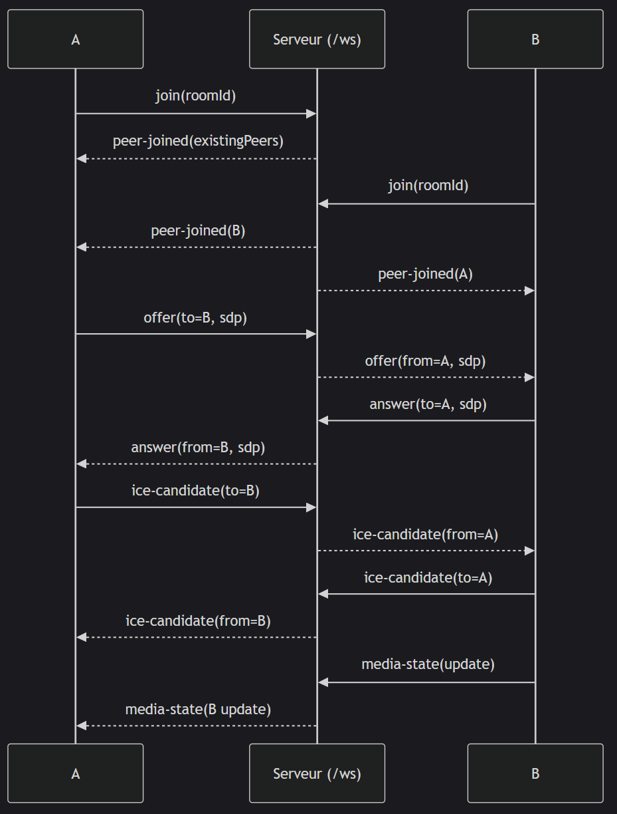

# ⚠️ DOC TEMPORAIRE ⚠️
# Commandes

Lancer le serveur :

```bash
npm run build
npm start
```
et dans un autre terminal lancer pour le whiteboard collaboratif (OT) :
```bash
npm run start:ot
```

Lancer le tunnel ngrok (si besoin) :
```bash
ngrok http 3000
```

# Mini-doc WebRTC — notions clés (à mettre dans ton README)

## 1) Vue d’ensemble

Ce projet établit des appels vidéo **P2P** via **WebRTC**.
On utilise un petit **serveur de signalisation** (WebSocket) pour s’échanger des messages techniques (pas les médias) : *offer*, *answer*, candidats **ICE**, état micro/cam, etc.
Ensuite, les flux **audio/vidéo** passent directement entre navigateurs (ou via **TURN** si nécessaire).

---

## 2) Concepts WebRTC essentiels

### Offer / Answer (SDP)

* **Offer** = proposition de session (codecs, pistes, crypto, etc.).
* **Answer** = réponse compatible à l’offre.
* Ces deux messages contiennent une **description SDP**.
* Ils s’échangent via la **signalisation** (ici, WebSocket), pas dans le média.

#### Cycle simplifié

1. **A** → `createOffer()` → `setLocalDescription(offer)` → envoie l’offer à **B**
2. **B** → `setRemoteDescription(offer)` → `createAnswer()` → `setLocalDescription(answer)` → renvoie l’answer
3. **A** → `setRemoteDescription(answer)`
4. En parallèle, **A** et **B** s’envoient des **candidats ICE** (voir ci-dessous).

### ICE, STUN, TURN

* **ICE** (*Interactive Connectivity Establishment*) cherche un chemin réseau joignable entre 2 pairs (derrière NAT/pare-feu).
* **Candidats ICE** = adresses potentielles (IP\:port) par lesquelles on peut communiquer :

  * `host` (IP locale)
  * `srflx` (IP publique découverte via **STUN**)
  * `relay` (IP/port d’un serveur **TURN** qui relaie le trafic)
* **STUN** : “voici ton IP publique”.
* **TURN** : relaie les médias quand le P2P direct est impossible (NAT symétriques, réseaux d’entreprise, CGNAT…).

#### Configuration typique

```js
const ICE_SERVERS = [
  { urls: "stun:stun.l.google.com:19302" }, // STUN public
  // Recommandé en prod : ajouter un TURN
  { urls: "turn:turn.example.com:3478", username: "webrtc", credential: "secret" },
  { urls: "turns:turn.example.com:5349?transport=tcp", username: "webrtc", credential: "secret" },
];
```

### `pc = RTCPeerConnection`

Dans le code, `pc` est l’abréviation de **PeerConnection** (pas “ordinateur”).
C’est l’objet qui gère : **ICE** (STUN/TURN), **DTLS-SRTP**, pistes audio/vidéo (`addTrack`/`ontrack`), **datachannels**, négociation **SDP**, **états/metrics**.

---

## 3) Topologies : full-mesh vs SFU

* **Full-mesh (P2P maillé)** : chaque participant ouvre un `RTCPeerConnection` par autre participant (**multi-pc**).
  Simple à coder, OK jusqu’à \~3–4 personnes (bande passante uplink ↑).
* **SFU (Selective Forwarding Unit)** : un serveur (mediasoup/Janus/LiveKit/Jitsi) reçoit et relaie tous les flux.
  Scalable (10+), une seule `pc` par client (vers le SFU), meilleure perf.

> **Ce projet implémente le full-mesh.**

---

## 4) Comment ça marche dans ce repo

### Signalisation (serveur WebSocket)

* Sert les fichiers statiques `/public`.
* Gère des rooms (`Map<roomId, clients>`).
* Messages principaux :

  * `join` / `joined` (avec la liste `peers` déjà présents),
  * `peer-joined` / `peer-left`,
  * `offer`, `answer`, `ice-candidate` (ciblés via `payload.to`),
  * `media-state` (mute/cam on/off).

### Flux d’un `join` en multi-participants

1. Client **C** envoie `join(roomId)`.
2. Serveur répond `joined` avec `peers = [A, B, …]` (déjà dans la room).
3. **C** crée un `RTCPeerConnection` par peer (**A**, **B**…) et envoie une **offer** ciblée à chacun.
4. **A/B** répondent avec **answer** ciblée, puis échanges **ICE** ciblés.
5. Dès qu’un couple de candidats fonctionne, les médias s’écoulent.

> Si deux participants (**B↔C**) ne se voient pas mais voient **A**, c’est souvent le **TURN** manquant.
> **Ajouter un TURN (UDP 3478 + TLS 5349/TCP)** résout la plupart des cas.

---

## 5) Pourquoi on voit “multi-pc” dans le code

Parce qu’en **full-mesh**, `N` participants ⇒ **N-1 `PeerConnections` par client**.

```js
const pcByPeerId = new Map(); // un RTCPeerConnection par peer distant
```

…et la création dynamique des **cartes vidéo** (une par peer).

---

## 6) Débogage & bonnes pratiques

### Vérifier ICE

* **Chrome** : `chrome://webrtc-internals` → “Selected candidate pair” (`host`/`srflx`/`relay`).

### Ajouter des logs

```js
pc.oniceconnectionstatechange = () => console.log('ice', pc.iceConnectionState);
pc.onconnectionstatechange   = () => console.log('pc',  pc.connectionState);
```

### Recommandations

* **HTTPS/WSS** recommandé (getUserMedia/permissions/TURN TLS).
* Limiter la **résolution/bitrate** en full-mesh si 4+ (ex. `640×360`).
* **TURN indispensable en prod.** Ouvrir les ports, prévoir **5349/TCP** pour réseaux stricts.

---

## 7) Limites & évolutions possibles

* **Full-mesh** : uplink multiplié par `(N-1)`. Pour `> 4`, envisager un **SFU**.
* Partage d’écran, enregistrement, chat/whiteboard : ajouter **DataChannels** et/ou une **CRDT (Yjs)** si état collaboratif persistant.

---

## TL;DR

* **Offer/Answer** : on s’accorde *comment parler*.
* **ICE/STUN/TURN** : on découvre *par où parler*.
* `pc = RTCPeerConnection`. En **full-mesh** → **multi-pc** (un par peer).
* Pour **3+ personnes**, ajoute un **TURN** (et idéalement un **SFU** si tu veux scaler).


# Pourquoi on parle d’« offre » (*offer*) ?

Parce que WebRTC utilise le modèle **SDP Offer/Answer** (RFC 3264) pour négocier une session multimédia.

* **Offer (offre)** : une description de session (SDP) proposée par le premier pair. Elle liste ce que j’aimerais envoyer/recevoir (pistes audio/vidéo, codecs, paramètres réseau, fingerprints DTLS, etc.).
* **Answer (réponse)** : l’autre pair accepte et renvoie sa propre description compatible.

> Le transport réel (paquets audio/vidéo) ne passe pas dans l’offre/réponse : ce sont juste des **métadonnées**.
> L’échange d’offre/réponse se fait via la **signalisation** (ici WebSocket).

Ensuite, on continue d’échanger des **candidats ICE** (voir ci-dessous) pour trouver un chemin réseau utilisable. C’est ce qu’on appelle **Trickle ICE** (on envoie les candidats au fil de l’eau sans attendre d’avoir toute la liste).

# Schéma ultra-court

1. **A** crée un `RTCPeerConnection` → `createOffer()` → `setLocalDescription(offer)` → envoie l’**offer** à **B**.
2. **B** fait `setRemoteDescription(offer)` → `createAnswer()` → `setLocalDescription(answer)` → renvoie l’**answer** à **A**.
3. **A** fait `setRemoteDescription(answer)`.

En parallèle, **A** et **B** s’échangent des **ICE candidates** jusqu’à ce qu’un couple (pair) fonctionne.

# C’est quoi ICE et `ICE_SERVERS` ?

**ICE** = *Interactive Connectivity Establishment* (RFC 8445).
C’est l’algorithme qui permet à deux machines derrière des NAT/pare-feu de découvrir un chemin réseau viable pour envoyer les flux audio/vidéo.

Un **candidat ICE** = une « coordonnée réseau » potentielle (**IP\:port + transport**) par laquelle on pourrait se joindre.

## Types de candidats

* **host** : IPs locales (ex. `192.168.x.x`).
* **srflx** (*server-reflexive*) : IP publique vue via un serveur **STUN**.
* **relay** : IP/port d’un serveur **TURN** qui relaie le trafic si rien d’autre ne marche.

## `ICE_SERVERS` : liste STUN/TURN

```js
const ICE_SERVERS = [
  { urls: "stun:stun.l.google.com:19302" }, // STUN public : donne des candidats srflx
  // TURN = relais (à ajouter si NAT stricts / réseaux d’entreprise)
  // { urls: "turn:turn.example.com:3478", username: "user", credential: "pass" },
  // { urls: "turns:turn.example.com:5349?transport=tcp", username: "user", credential: "pass" },
];
```

# STUN vs TURN

* **STUN** (*Session Traversal Utilities for NAT*) : « Quel est mon IP/port publics ? » → produit des candidats **srflx**.
* **TURN** (*Traversal Using Relays around NAT*) : « Relaye mes médias si on ne peut pas percer le NAT » → produit des candidats **relay**.
  Indispensable quand deux pairs ne peuvent pas se joindre directement (NAT symétriques, réseaux d’entreprise, CGNAT mobile, etc.).


# WebRTC Mini – Architecture & flux

> Copiez-collez tel quel dans votre `README.md`.

## Sommaire

* [Aperçu](#aperçu)
* [Architecture](#architecture)

  * [1) Serveur “app” (Express + WebRTC)](#1-serveur-app-express--webrtc)
  * [2) Serveur OT (ShareDB) séparé](#2-serveur-ot-sharedb-séparé)
  * [3) Client — Landing](#3-client--landing)
  * [4) Client — Workspace (composition UI)](#4-client--workspace-composition-ui)
  * [5) Appel vidéo P2P (WebRTC)](#5-appel-vidéo-p2p-webrtc)
  * [6) Bloc-note collaboratif (OT + Quill)](#6-bloc-note-collaboratif-ot--quill)
* [Données & persistance](#données--persistance)
* [Démarrer / développer](#démarrer--développer)
* [Schémas (Mermaid)](#schémas-mermaid)
* [Arborescence minimale](#arborescence-minimale)

---

## Aperçu

Deux serveurs :

* **Serveur app** (`server.js`) : Express + Twig + WebSocket de signalisation WebRTC + API REST.
* **Serveur OT** (`ot-server.js`) : ShareDB + `sharedb-mongo` + type `rich-text` (port **3001**).

Un client web :

* **Landing** (création de room).
* **Workspace** avec **appel vidéo P2P** (WebRTC) + **bloc-note collaboratif** (Quill + OT).

---

## Architecture

### 1) Serveur “app” (Express + WebRTC)

**Fichier :** `server.js`
**Rôle :** sert le site (Twig) et les assets `/public`.

#### Routes

```http
POST /api/rooms/new
  → crée une room (collection Mongo "rooms")
  → ensureOTDoc(roomId) (crée le doc ShareDB s’il n’existe pas)
  → renvoie l’URL de la room (/room/:id)

GET /room/:roomId
  → vérifie l’existence de la room
  → ensureOTDoc(roomId)
  → rend views/workspace.twig
```

#### Signalisation WebRTC via WebSocket `/ws`

Gère les événements :

```
join, peer-joined, offer, answer, ice-candidate, peer-left, media-state
```

#### Mémoire (clients par room)

```ts
Map<roomId, Map<clientId, WebSocket>>
```

#### MongoDB (Mongoose)

* Modèle **Room** (collection `rooms`).

---

### 2) Serveur OT (ShareDB) séparé

**Fichier :** `ot-server.js` (port **3001**)
**Stack :** ShareDB + `sharedb-mongo` + type **rich-text**.
**WebSocket dédié :** chaque connexion est “branchée” à ShareDB via `websocket-json-stream`.

#### Persistance

* `docs` : snapshot courant (Delta Quill)
  Champs : `_id = roomId`, `type = "rich-text"`, `v = version`.
* `o_docs` : historique d’opérations (journal OT).

**Propriété :** redémarrez les serveurs → le contenu revient depuis `docs`.

---

### 3) Client — Landing

**Fichier :** `public/assets/js/landing.js`
Bouton **“Créer une room”** :

```txt
POST /api/rooms/new
→ redirige vers /room/:id?autojoin=1&host=1
```

---

### 4) Client — Workspace (composition UI)

**Template :** `views/workspace.twig` inclut :

* `components/whiteboard.twig` (éditeur/whiteboard)
* `components/call.twig` (panneau appel vidéo)

**Scripts chargés :**

* `/assets/js/workspace.js` → expose `window.ROOM_ID`, flags `autojoin` & `host`.
* `/assets/vite/ot-main.js` → éditeur collaboratif OT.
* `/assets/js/app.js` → WebRTC (audio/vidéo).

---

### 5) Appel vidéo P2P (WebRTC)

**Fichier :** `public/assets/js/app.js`

* Capture : `getUserMedia` (micro/caméra), toggles mute/cam, overlay, raccourcis **M/V**.
* Connexion WS `/ws` → **mesh** `RTCPeerConnection` (un peer connection par remote).
* Négociation : `offer` / `answer` / `ice-candidate` routés par le serveur.
* UI participants : cartes vidéo locale/distantes, badges d’état (mute/cam), overlays.
* **STUN** : `stun:stun.l.google.com:19302`.

---

### 6) Bloc-note collaboratif (OT + Quill)

**Source :** `src/ot-main.js` (bundlé par Vite → `/assets/vite/ot-main.js`)

Flux :

```js
// Initialisation
const quill = new Quill('#editor', {/* ... */});

// Connexion OT
const connection = new ShareDB.Connection(new WebSocket('ws://localhost:3001'));
const doc = connection.get('docs', ROOM_ID);
doc.subscribe();

// Démarrage : injecte le snapshot (Delta) dans Quill
doc.on('load', () => quill.setContents(doc.data || []));

// Quill → ShareDB (édition locale)
quill.on('text-change', (delta, old, source) => {
  if (source === 'user') doc.submitOp(delta);
});

// ShareDB → Quill (op distante)
doc.on('op', (op, source) => {
  if (source) return;         // déjà appliqué localement
  quill.updateContents(op);
});
```

**Important :** le document est **créé côté serveur** via `ensureOTDoc(roomId)` → le client ne fait que `subscribe` (pas de `create`) pour éviter les conditions de course.

---

## Données & persistance

**Base MongoDB :** `webrtcmini`

Collections :

* `rooms` → rooms créées (modèle Mongoose `Room`).
* `docs` → état courant du bloc-note par room (`_id = roomId`, `data = Delta`).
* `o_docs` → journal des opérations OT.

Comportement :

> À l’ouverture d’une room, l’app lit `docs[_id=roomId]` pour remplir l’éditeur.
> Chaque frappe produit une op enregistrée en base et diffusée aux autres clients.

---

## Démarrer / développer

**Build client OT** (si vous modifiez `src/ot-main.js`)

```bash
npm run build
```

**Serveur app** (HTTP + `/ws`)

```bash
npm start
```

**Serveur OT** (ShareDB, port 3001)

```bash
npm run start:ot
```

**Ouvrir l’app**

```
http://localhost:3000
→ créez/partagez une room depuis la landing
```

---

## Schémas (Mermaid)

### Signalisation WebRTC (simplifiée)



Un **ICE candidate** (WebRTC) est une “possibilité de chemin réseau” qu’un pair propose pour établir la connexion P2P.

En pratique, **un candidate décrit** :

* une **IP** + **port**,
* un **protocole** (UDP/TCP),
* un **type** et une **priorité**.

**Types courants**

* **host** : IP locale (sur ton LAN).
* **srflx** (server-reflexive) : IP publique découverte via **STUN** (traverse la plupart des NAT).
* **relay** : IP/port d’un **serveur TURN** (relais quand direct impossible).

**Pourquoi c’est utile ?**
Derrière des NAT/pare-feu, on ne sait pas d’avance par où passer. Les pairs **collectent** plusieurs candidats, se les **échangent via le serveur de signalisation** (dans ton schéma, `S`), puis le protocole **ICE** teste ces combinaisons et **choisit la meilleure** (connectivity checks). C’est ce qu’on appelle aussi **trickle ICE** quand on envoie les candidats au fur et à mesure qu’on les découvre.

**Dans le diagramme**
Les messages `ice-candidate` sont juste l’**échange de ces coordonnées réseau** entre A et B, routés par `S`, pour permettre la connexion P2P.

*Exemple (simplifié)*

```
a=candidate:842163049 1 udp 1677729535 203.0.113.5 53624 typ srflx raddr 192.168.1.10 rport 53624
```


---

## Arborescence minimale

```txt
.
├─ server.js
├─ ot-server.js
├─ views/
│  ├─ workspace.twig
│  └─ components/
│     ├─ whiteboard.twig
│     └─ call.twig
├─ public/
│  └─ assets/
│     └─ js/
│        ├─ landing.js
│        ├─ workspace.js
│        └─ app.js
├─ src/
│  └─ ot-main.js
└─ (build) /assets/vite/ot-main.js  ← généré par Vite
```

---
